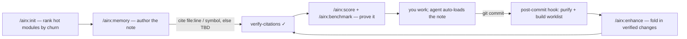

# airx

**Your coding agent forgets your codebase every session. airx gives it memory it can trust.**

Point Claude Code (or any agent) at a large repo and watch it re-derive the same context every time:
grep thousands of files, guess the wrong path, re-break a business rule a ticket fixed last month — and
burn tokens doing it. The usual fix is another vector store that promises "120x fewer tokens" and never
proves it on *your* repo.

airx takes a different bet. It writes your repo a small, **verified** project memory — every claim cites
a real `file:line` or says `TBD`, never a guess — and grades it on what actually matters: **does the agent
reach the right root cause and avoid the wrong change?** Quality (`/airx:score` — Coverage · Depth · Trust)
and behavior lead; the measured token win (`/airx:benchmark`) is a real-but-secondary signal — a thin stub
scores ~99% on tokens and is still useless. Built for **large legacy codebases** (first proven on a
5,500-file Java/PrimeFaces monolith), where agents waste the most.

**It grows with you.** Start with project memory (works on *any* codebase). Add documentation, a
knowledge base, or a viewer **only if you want them** — each layer verified and measured, never forced,
never bloating your repo by default. New here? See [docs/GETTING-STARTED.md](docs/GETTING-STARTED.md).

## Prerequisites

- **Claude Code** — airx is a plugin; the `/airx:*` commands run inside a Claude Code session (the
  agent-driven `/airx:memory` and `/airx:refresh` need model access).
- **Python 3.7+** — every deterministic tool (`init` / `check` / `score` / `benchmark` / `verify-citations`
  / `evidence` / `purify` / `memdiff` / `docs` / `kb`) is **stdlib-only**; nothing to `pip install`, no
  server, no vector DB, no egress.
- **git** — point it at a git repo; airx anchors freshness to `HEAD` and mines ticket history for the
  "why / what-changed". Without git, `init` still runs but `code_ref` falls back to `TBD`.

## Try it in 60 seconds

Install the Claude Code plugin — published, or from a local clone (beta):

```
/plugin marketplace add amotion-ai/airx     # public
/plugin install airx@airx
# — or, from a clone you've cd'd into (beta) —
/plugin marketplace add .
/plugin install airx@airx
```

Then, in your repo:

```
/airx:init --repo . --install-hook   stamp memory inside the repo (auto-loads) + the self-improve hook
/airx:memory                         capture a hot module — airx proposes them, ranked by git churn
/airx:benchmark · /airx:score · /airx:evidence   prove it: token delta, quality (Coverage·Depth·Trust), one verdict
```

No servers, no embeddings, no config — just `python3` (stdlib) and `git`. Beta teams: see
[BETA-QUICKSTART.md](BETA-QUICKSTART.md) for the full first-run flow.

## The loop

**Create** — `/airx:init` stamps `ai_memory/` + root `CLAUDE.md`/`AGENTS.md` inside the repo (agent
auto-loads it), detects the stack, ranks candidate modules by git churn, and can install the post-commit
self-improve hook. `/airx:memory` then writes one dense **symbol-first** verified note (stop-and-show; you
approve each claim). `/airx:validate` audits memory you *already* have (coverage / drift / freshness /
discipline → a report).

**Trust & measure** — `/airx:check` (conformance + **drift** gate, exit-codes so it gates CI) ·
`/airx:score` (quality score — **Coverage · Depth · Trust**; tells you GOOD vs *NOT DONE*) ·
`/airx:benchmark` (the real token delta on your repo) · `/airx:memtest` (answer real questions from the
note alone — proves recall).

**Keep it living** — `/airx:purify` (flag stale/dangling citations — never invents) · `/airx:enhance`
(fold what a commit changed into memory, verified, human-in-loop) · `/airx:update` (after a ticket) ·
`/airx:refresh` (re-verify the whole wiki against `HEAD`).

### Self-improving memory (opt-in)
With `/airx:init --install-hook`, a **git `post-commit` hook** keeps memory honest as you work: on each
commit it **auto-purifies** stale citations and builds an enhancement worklist (`PENDING-ENHANCEMENTS.md`)
— deterministic, non-blocking, **zero model tokens, never edits your notes**. You fold it in with
`/airx:enhance` (human-in-loop by default; an `auto_enhance` toggle can auto-land *verified* symbol facts).
Memory's Coverage/Depth/Trust then **trend up across commits** — and `/airx:score` proves it.

**One verdict** — `/airx:evidence` rolls the above into a single plain-English report: is memory earning
its place? **QUALITY + TRUST headline, token-% printed last and explicitly not the bar.**

Optional layers you can add later, only if you want them: **`/airx:docs`** (human documentation) ·
**`/airx:kb`** (knowledge base — the per-stack token lever); a viewer to browse what you've built is on
the [roadmap](ROADMAP.md).

## Command reference (what · how · why)

Every command, what it does, how to run it, and when you'd reach for it. All deterministic tools are
stdlib-only Python (no servers, no embeddings); the agent-driven ones (`memory`/`validate`/`enhance`/
`update`) reason about your code in-session.

| command | what it does | how | why / when |
|---|---|---|---|
| `/airx:init` | stamp `ai_memory/` + `CLAUDE.md`/`AGENTS.md`, rank hot modules by churn, (opt) install the post-commit hook | `/airx:init --repo . --install-hook` | first-time setup on a repo |
| `/airx:draft` | auto-extract an **unverified** candidate stub (`_draft_<m>.md`) from code | `/airx:draft [module]` | jump-start authoring; the human then verifies |
| `/airx:memory` | author one dense **verified** note (stop-and-show; symbol-first) | `/airx:memory [module]` | capture a hot module's why / what-changed / traps |
| `/airx:validate` | audit *existing* memory — coverage / drift / freshness / discipline → report | `/airx:validate` | a repo that already has memory |
| `/airx:check` | conformance + **drift** gate; dangling `file:line` → FAIL (exit codes) | `/airx:check` | CI gate; after any edit |
| `/airx:score` | quality grade **Coverage · Depth · Trust** + `NEXT:` module to do | `/airx:score` | "is it good, and what next?" |
| `/airx:benchmark` | measured token delta (verified note vs grepping cold) | `/airx:benchmark` | prove the token win on *your* repo |
| `/airx:evidence` | one-verdict rollup — quality+trust headline, token-% secondary | `/airx:evidence` | "is memory actually working?" |
| `/airx:memtest` | answer real questions from the note **alone**, no grep | `/airx:memtest [module]` | prove recall |
| `/airx:purify` | flag stale/dangling citations — **never invents, never deletes** | `/airx:purify [--apply]` | keep memory honest as code moves |
| `/airx:enhance` | fold a commit's changes into memory (verified, human-in-loop) | `/airx:enhance [module]` | after a commit / ticket |
| `/airx:update` | update one module note after a ticket (append ticket history) | `/airx:update <module> <ticket>` | post-ticket freshness |
| `/airx:refresh` | re-verify the whole wiki against current `HEAD` | `/airx:refresh` | deliberate periodic catch-up |
| `/airx:docs` | scaffold `ai_documentation/` templates (opt-in) | `/airx:docs` | human onboarding narrative |
| `/airx:kb` | generate deterministic Java registries (opt-in token lever) | `/airx:kb` | big repo where grep is the bottleneck |

> All 15 are verified to run on a real Spring Boot repo (3,755 files) — see [docs/BETA-EVIDENCE.md](docs/BETA-EVIDENCE.md).

## How a memory note works (and how to read one)

airx writes one dense Markdown note per hot module. Two conventions make it trustworthy:

- **`file:line`** — a citation pointing at the exact source line a claim came from, e.g.
  `BillingService.java:586`. You or the agent can open it and check. airx also accepts durable **symbols**
  (a class name like `BillingService`, a `queries.xml` name like `Inbox.getWorkbasketCreatedDate`, a bean
  id) which survive line churn — `verify-citations` resolves all of these mechanically.
- **`TBD`** — *to be determined*. airx refuses to guess: if a fact can't be cited, the note writes
  `TBD — needs human input` instead of inventing one. A `TBD` is a **visible gap, not a lie** — that's the
  whole point. (You'll see counts like "9 verified citations; 10 flagged verify" — the flagged ones are honest TBDs.)

The loop that produces and keeps a note alive:



## Keeping memory honest — purify, drift, enhance

**Why bother?** Code changes. A note that cited `BillingService.java:521` becomes wrong the moment that
method moves. **A stale note that reads as current is worse than none** — the agent confidently trusts a
lie. airx never lets that sit silently; three pieces keep memory honest:

- **`drift` (detect — automatic).** `/airx:check` re-resolves every citation against the *current* code and
  reports a resolution rate. A dangling `file:line` is a hard **FAIL** (so it gates CI); symbol drift shows
  as a percentage.
- **`/airx:purify` (flag — safe by construction).** Finds citations that no longer resolve and marks them.
  It **never invents a fix and never deletes a claim** — it only flags. Two modes:
  - *report-only* (default; what the post-commit hook runs): prints findings, **edits nothing**.
  - `--apply`: appends `⚠️ STALE — re-verify` to the offending line and stamps `needs_review:` in the
    note's frontmatter, for you to review as a diff.
- **`/airx:enhance` · `/airx:update` (fix — human-in-loop).** Re-verify the flagged claim against current
  code, correct it or downgrade to `TBD`, bump `code_ref`. After each commit the post-commit hook
  auto-purifies and writes a worklist; you fold it in.

Real run on a repo where a cited method had moved (`BillingService.java:521` no longer exists):

```text
/airx:check          → citations FAIL  (line 99999 > 10459 lines — stale?)
/airx:purify         → reference_web.md: 1 dangling — BillingService.java:99999   (report-only, no edits)
/airx:purify --apply → flags the line "⚠️ STALE — re-verify", sets needs_review in frontmatter
# human re-verifies the real line, fixes it →
/airx:check          → OVERALL PASS
```

The rule that makes this safe to automate: **purify can only remove a lie, never add one.** Automation
flags; humans verify. (Run `/airx:purify` on a schedule or rely on the post-commit hook; deliberate
catch-up across the whole wiki is `/airx:refresh`.)

## Does it actually work?

**The proof is behavior, not token-%.** In a controlled A/B on a real Spring Boot repo (same bug, with vs
without airx memory), the **cold** agent produced a confident, scope-risky multi-tenant fix that was
**wrong** — in *both* runs. The **airx-memory** agent avoided it **both times**: it reached the
company-vs-distributor scoping model and didn't make the wrong change. Reproducible directionally;
precision scales with note depth. *That* — "avoids the wrong fix" — is the result, not a token number.

Why memory caught what structure can't: the saving note carried **verified intent** — *this method is
misnamed, it drives tenant scoping, don't revert it*. A call graph or LSP sees the edges; it cannot tell
you the method is mislabeled or that reverting it breaks tenancy.

Backing it up, the original single-module run (~5,500 Java files, ~1,300 XHTML views, multi-tenant
Hibernate; one `/airx:init`, one `/airx:memory`):

- **9 verified `file:line` citations; 10 flagged "verify" — nothing fuzzy was stated as fact.**
- **Predict-and-verify caught 2 bugs before they shipped:** a method name *misspelled in the codebase*
  (you have to grep the typo, not the correct spelling), and a rounding method whose signature didn't
  match. A store-everything tool would have embedded both as truth.
- **Captured a "do-not-revert" ticket lesson** that lives nowhere in the code — exactly the intent an
  agent re-derives every session.

Single-module writeup: [docs/CASE-STUDY.md](docs/CASE-STUDY.md).

## Why it's different

airx is the **verified-intent layer**. It doesn't compete with the retrieval foundation — it **composes
on it** and adds what the other camps skip.

- **On top of a graph/LSP foundation (CodeGraph / Serena), not against it.** Those index *structure* —
  symbols, call edges, definitions — brilliantly. airx records *intent*: "this method is misnamed; it
  drives tenant scoping; don't revert it." The A/B trap above is exactly the gap — a call graph is
  structurally blind to a mislabeled method or a do-not-revert rule. Keep your graph/LSP; airx layers the
  human "why" on it.
- **vs the memory camp (agentmemory, codebase-memory-mcp): verification + drift + self-improve.** They
  store or embed, then oversell. Every airx claim carries a real anchor — `file:line` **or a durable
  symbol** (class / `queries.xml` name / bean id) — or says `TBD`. `verify-citations` resolves them
  *mechanically*, a `drift` signal flags when code moves out from under the notes, and a post-commit hook
  keeps memory honest as you ship (auto-purify only flags, never invents; enhancement stays human-in-loop).
  A stale note is worse than none.
- **Graded on quality, not token-%.** Token-reduction is *not* a quality measure (a thin stub scores
  ~99%). `/airx:score` grades **Coverage · Depth · Trust** and `/airx:evidence` gives one verdict —
  QUALITY + TRUST headline, token-% printed last — so you see GOOD vs *NOT DONE*, not "fast but useless."
- **Composes, doesn't clone.** A Claude Code plugin on the supported surface (plugins / skills / MCP),
  not a fragile CLI wrapper or yet another storage engine.

The method behind it: [docs/THESIS.md](docs/THESIS.md) — rank by objective, size by leverage, prove by
measurement.

## Where we are

v0.1, early and honest about it. The memory loop works today — and `/airx:evidence`, `/airx:docs`, and
`/airx:kb` are now built (kb's per-stack generator packs grow over time; a stack with no pack yet is
honestly "memory-only"). A viewer is still on the [roadmap](ROADMAP.md). Caveats we keep: memory needs
**≥1 authored note** to help, and quality scales with coverage — one note covers one module, not eight.

**Independently tested.** In a blind A/B on a real Spring Boot repo, the airx-memory agent avoided a
multi-tenant fix the no-memory agent got wrong — confirmed by a judge that didn't know which arm was which.
Full write-up: [docs/BETA-EVIDENCE.md](docs/BETA-EVIDENCE.md).

New? [docs/GETTING-STARTED.md](docs/GETTING-STARTED.md). Adopting with a team? [TEAM-START.md](TEAM-START.md).

## License

MIT — see [LICENSE](LICENSE).
