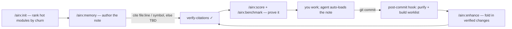

# airx

**Your coding agent forgets your codebase every session. airx gives it memory it can trust.**

Point an agent at a large repo and it re-derives the same context every time: greps thousands of files,
guesses the wrong path, re-breaks a business rule a ticket fixed last month — burning tokens to do it. The
usual fix is another vector store promising "120× fewer tokens" that never proves it on *your* repo.

airx takes a different bet: it writes your repo a small, **verified** project memory. Every claim cites a
real `file:line` or durable symbol — or says `TBD`, never a guess. Then it grades memory on what actually
matters: **does the agent reach the right root cause and avoid the wrong change?** Quality and behavior
lead; the measured token win is real but secondary (a thin stub scores ~99% on tokens and is still
useless). Built for **large legacy codebases**, where agents waste the most.

**It grows with you.** Start with project memory — works on any codebase. Add docs, a knowledge base, or a
viewer **only if you want them**. Each layer is verified and measured; nothing is forced or bloats your
repo by default.

```
memory  →  docs  →  kb  →  viewer
 (now)    (opt)   (opt)  (roadmap)
 ─────────────────────────────────
 each layer: verified · measured · opt-in
```

## Install (60 seconds)

airx is a Claude Code plugin. No servers, no embeddings, no config — just **Python 3.7+** (stdlib-only
tools) and **git**.

```
/plugin marketplace add amotion-ai/airx     # public
/plugin install airx@airx
# — or, from a clone you've cd'd into (beta) —
/plugin marketplace add .
/plugin install airx@airx
```

Then, in your repo:

```
/airx:init --repo . --install-hook   stamp memory in the repo (auto-loads) + the self-improve hook
/airx:memory                         capture a hot module — airx ranks candidates by git churn
/airx:benchmark · /airx:score · /airx:evidence   prove it: token delta, quality, one verdict
```

New here? [docs/GETTING-STARTED.md](docs/GETTING-STARTED.md). Adopting with a team?
[TEAM-START.md](TEAM-START.md). Beta first-run: [BETA-QUICKSTART.md](BETA-QUICKSTART.md).

## How it works

airx writes one dense, verified Markdown note per hot module. Two conventions make it trustworthy:

- **`file:line` / symbol** — a citation pointing at the exact source a claim came from (e.g.
  `BillingService.java:586`, or a durable symbol like a class, a `queries.xml` name, or a bean id that
  survives line churn). `verify-citations` resolves them all mechanically.
- **`TBD`** — airx refuses to guess. If a fact can't be cited, the note writes `TBD — needs human input`.
  A `TBD` is a **visible gap, not a lie** — that's the whole point.

The loop that produces a note and keeps it alive:



**Self-improving (opt-in).** With `--install-hook`, a git `post-commit` hook keeps memory honest as you
work: on each commit it auto-purifies stale citations and builds an enhancement worklist
(`PENDING-ENHANCEMENTS.md`) — deterministic, non-blocking, **zero model tokens, never edits your notes**.
You fold it in with `/airx:enhance`. Coverage/Depth/Trust then trend up across commits.

## Command reference

All deterministic tools are stdlib-only Python (no servers, no embeddings). The agent-driven ones
(`memory` / `validate` / `enhance` / `update`) reason about your code in-session.

| command | what it does | why / when |
|---|---|---|
| `/airx:init` | stamp `ai_memory/` + `CLAUDE.md`/`AGENTS.md`, rank hot modules, (opt) install the hook | first-time setup |
| `/airx:draft` | auto-extract an **unverified** candidate stub from code | jump-start authoring |
| `/airx:memory` | author one dense **verified** note (stop-and-show; symbol-first) | capture a hot module |
| `/airx:validate` | audit *existing* memory — coverage / drift / freshness → report | a repo with memory already |
| `/airx:check` | conformance + **drift** gate; dangling `file:line` → FAIL (exit codes) | CI gate; after any edit |
| `/airx:score` | quality grade **Coverage · Depth · Trust** + `NEXT:` module | "is it good, what next?" |
| `/airx:benchmark` | measured token delta (verified note vs grepping cold) | prove the win on *your* repo |
| `/airx:evidence` | one-verdict rollup — quality+trust headline | "is memory actually working?" |
| `/airx:memtest` | answer real questions from the note **alone**, no grep | prove recall |
| `/airx:purify` | flag stale/dangling citations — **never invents, never deletes** | keep memory honest |
| `/airx:enhance` | fold a commit's changes into memory (verified, human-in-loop) | after a commit / ticket |
| `/airx:update` | update one note after a ticket (append ticket history) | post-ticket freshness |
| `/airx:refresh` | re-verify the whole wiki against current `HEAD` | periodic catch-up |
| `/airx:docs` | scaffold `ai_documentation/` templates (opt-in) | human onboarding narrative |
| `/airx:kb` | generate deterministic Java registries (opt-in token lever) | big repo, grep is the bottleneck |

> All 15 verified on a real Spring Boot repo (3,755 files) — see [docs/BETA-EVIDENCE.md](docs/BETA-EVIDENCE.md).

## Keeping memory honest

Code changes. A note that cited `BillingService.java:521` is wrong the moment that method moves — and **a
stale note that reads as current is worse than none.** airx never lets that sit silently:

- **drift (detect, automatic).** `/airx:check` re-resolves every citation against current code; a dangling
  `file:line` is a hard **FAIL** (gates CI), symbol drift shows as a percentage.
- **`/airx:purify` (flag, safe by construction).** Finds citations that no longer resolve and marks them.
  It **never invents a fix and never deletes a claim.** Report-only by default (what the hook runs);
  `--apply` appends `⚠️ STALE — re-verify` and stamps `needs_review:` for you to review as a diff.
- **`/airx:enhance` · `/airx:update` (fix, human-in-loop).** Re-verify the flagged claim, correct it or
  downgrade to `TBD`, bump `code_ref`.

The rule that makes this safe to automate: **purify can only remove a lie, never add one.** Automation
flags; humans verify.

## Does it actually work?

**The proof is behavior, not token-%.** In a blind A/B on a real Spring Boot repo (same bug, with vs
without airx memory, judged by someone who didn't know which arm was which), the **cold** agent produced a
confident, scope-risky multi-tenant fix that was **wrong** — in *both* runs. The **airx-memory** agent
avoided it **both times**: it reached the correct tenant-scoping model and didn't make the wrong change.

Why memory caught what structure can't: the note carried **verified intent** — *this method is misnamed,
it drives tenant scoping, don't revert it.* A call graph or LSP sees the edges; it cannot tell you the
method is mislabeled or that reverting it breaks tenancy.

The original single-module run (~5,500 Java files, multi-tenant Hibernate; one `init`, one `memory`):

- **9 verified citations; 10 flagged "verify" — nothing fuzzy stated as fact.**
- **Predict-and-verify caught 2 bugs before they shipped:** a method name *misspelled in the codebase*
  (you have to grep the typo), and a rounding method whose signature didn't match. A store-everything tool
  would have embedded both as truth.
- **Captured a "do-not-revert" ticket lesson** that lives nowhere in the code.

Write-ups: [docs/CASE-STUDY.md](docs/CASE-STUDY.md) (single module) · [docs/BETA-EVIDENCE.md](docs/BETA-EVIDENCE.md) (blind A/B).

## Why it's different

airx is the **verified-intent layer**. It composes on the retrieval foundation instead of competing with it.

- **On top of graph/LSP, not against it.** Tools like CodeGraph / Serena index *structure* — symbols, call
  edges, definitions. airx records *intent*: "this method is misnamed; don't revert it." A call graph is
  structurally blind to a mislabeled method or a do-not-revert rule. Keep your graph; airx layers the "why."
- **Verification the memory camp skips.** Others store or embed, then oversell. Every airx claim carries a
  real anchor or says `TBD`; `verify-citations` resolves them mechanically, drift flags when code moves, and
  the post-commit hook keeps memory honest as you ship.
- **Graded on quality, not token-%.** A thin stub scores ~99% on tokens and is useless. `/airx:score`
  grades **Coverage · Depth · Trust**; `/airx:evidence` gives one verdict — so you see GOOD vs *NOT DONE*.
- **Composes, doesn't clone.** A Claude Code plugin on the supported surface (plugins / skills / MCP), not a
  fragile CLI wrapper or yet another storage engine.

The method behind it: [docs/THESIS.md](docs/THESIS.md) — rank by objective, size by leverage, prove by
measurement.

## Where we are

v0.1, early and honest. The memory loop works today; `/airx:evidence`, `/airx:docs`, and `/airx:kb` are
built (kb's per-stack packs grow over time — a stack with no pack yet is honestly "memory-only"). A viewer
is on the [roadmap](ROADMAP.md). Caveats we keep: memory needs **≥1 authored note** to help, and quality
scales with coverage — one note covers one module, not eight.

## License

MIT — see [LICENSE](LICENSE).
